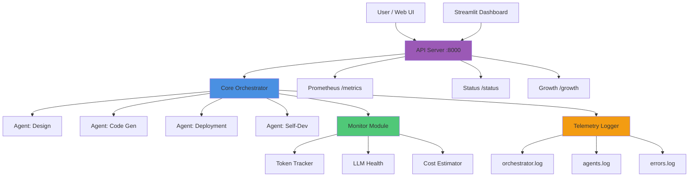

# 🤖 DevAI Orchestrator

> **A fully-featured DevAI Orchestration system with multi-agent coordination, comprehensive monitoring, and self-development tracking.**

Enterprise-grade AI orchestration platform designed for senior technical managers, combining intelligent task routing, observability metrics, cost tracking, and personal growth monitoring in a single cohesive system.

---

## 🌟 Key Features

### 🧠 AI Usage & Health Monitoring
- **Multi-Agent Orchestration**: Coordinate Claude Code, ChatGPT, Gemini, and local LLMs
- **Token Usage Tracking**: Real-time monitoring of LLM consumption across all providers
- **Cost Estimation**: Automatic cost calculation with detailed breakdown by model
- **Health Checks**: Monitor LLM availability and latency

### 🛡️ Local LLM Mode
- **Privacy-First**: Run sensitive workloads on local models (Ollama, Llama2, Mistral)
- **Zero Cost**: Eliminate API costs for development and testing
- **Offline Capability**: Full functionality without internet dependency

### 🔍 Agent Telemetry & Audit Trail
- **Structured JSON Logging**: All events logged in machine-readable format
- **Phase Tracking**: Monitor progression through orchestration phases
- **Error Tracking**: Comprehensive error logging and categorization
- **Audit Compliance**: Complete audit trail for enterprise requirements

### 🌱 Self-Development Tracking
- **Goal Management**: Track professional development goals with progress metrics
- **Learning Hours**: Automatic tracking of learning time investment
- **AI-Generated Reflections**: Periodic insights and progress summaries
- **Milestone Tracking**: Document significant achievements
- **Skills Inventory**: Maintain portfolio of acquired skills

### 📊 Observability Stack
- **Prometheus Metrics**: Industry-standard metrics export
- **Grafana Dashboards**: Visual monitoring (optional integration)
- **Streamlit Dashboard**: Built-in real-time visualization
- **REST API**: Programmatic access to all metrics

---

## 🏗️ Architecture



### Component Overview

| Component | Purpose | Port/Path |
|-----------|---------|-----------|
| **Core Orchestrator** | Multi-agent workflow coordination | N/A |
| **API Server** | FastAPI REST endpoints | 8000 |
| **Monitor Module** | Token & health tracking | N/A |
| **Cost Estimator** | LLM cost calculation | N/A |
| **Telemetry Logger** | Structured JSON logging | logs/ |
| **Self-Dev Agent** | Growth tracking | N/A |
| **Streamlit Dashboard** | Visual interface | 8501 |
| **Prometheus Metrics** | Observability | /metrics |

---

## 🚀 Quick Start

### Prerequisites
- Python 3.11+
- Poetry (recommended) or pip
- Optional: Docker for containerized deployment

### Installation

```bash
# Clone repository
git clone <repo-url>
cd ai-orchestrator

# Install dependencies
poetry install
# OR
pip install -r requirements.txt

# Configure environment
cp .env.example .env
nano .env  # Add your API keys
```

### Environment Configuration

```bash
# .env
ANTHROPIC_API_KEY=sk-ant-...
OPENAI_API_KEY=sk-...
GOOGLE_API_KEY=AI...

# Optional: Local LLM
LOCAL_LLM_ENABLED=true
LOCAL_LLM_BASE_URL=http://localhost:11434
LOCAL_LLM_MODEL=llama2:13b

# Monitoring
QUALITY_CHECK_ENABLED=true
PROMETHEUS_ENABLED=true
```

### Run Simulation

```bash
# Execute complete orchestrator workflow
python simulate_run.py

# Output:
# - manifest_state.json (full state)
# - orchestrator_summary.json (summary)
# - logs/ directory (telemetry)
```

### Start API Server

```bash
cd api
python server.py

# Available at:
# - http://localhost:8000/docs (Swagger UI)
# - http://localhost:8000/metrics (Prometheus)
# - http://localhost:8000/status (System status)
# - http://localhost:8000/growth (Self-dev metrics)
```

### Launch Dashboard

```bash
cd dashboard
streamlit run dashboard.py

# Opens at http://localhost:8501
```

---

## 📖 Usage Guide

### Running Multi-Agent Workflow

```python
from ai_orchestrator import (
    initialize_project_context,
    agent_design_architecture,
    agent_code_generation,
    agent_deployment_ci
)
from self_dev_agent import agent_self_development

# Initialize
manifest = initialize_project_context()

# Execute workflow
manifest = agent_design_architecture(manifest)
manifest = agent_code_generation(manifest)
manifest = agent_deployment_ci(manifest)
manifest = agent_self_development(manifest)

# Manifest now contains complete execution state
```

### Monitoring Token Usage

```python
from monitor import log_token_usage, check_local_llm_health

# Log tokens
manifest = log_token_usage(
    agent_name="claude",
    tokens_used=1500,
    manifest=manifest,
    model="claude-3-sonnet-20240229"
)

# Check LLM health
manifest = check_local_llm_health(manifest)
```

### Cost Estimation

```python
from cost_estimator import calculate_costs, print_cost_summary

# Calculate costs from token usage
manifest = calculate_costs(manifest)

# Display summary
print_cost_summary(manifest)
# Output: Breakdown by agent/model with total cost
```

### Telemetry Logging

```python
from telemetry_logger import get_telemetry_logger

tel = get_telemetry_logger()

# Log agent execution
tel.log_agent_execution(
    agent="Claude Code",
    phase="Code Generated",
    tokens_used=1780,
    status="success"
)

# Log phase transition
tel.log_phase_transition(
    from_phase="Design",
    to_phase="Implementation",
    duration_seconds=45.3
)
```

### Self-Development Tracking

```python
from self_dev_agent import SelfDevelopmentAgent

agent = SelfDevelopmentAgent()

# Track learning hours
manifest = agent.track_learning_hours(manifest, hours=2.5)

# Add milestone
manifest = agent.add_milestone(
    manifest,
    title="Completed AI Orchestrator",
    description="Built production-grade system"
)

# Generate reflection
reflection = agent.generate_reflection(context)
```

---

## 📊 Metrics & Monitoring

### Prometheus Metrics Exposed

```prometheus
# Token Usage
ai_orchestrator_llm_tokens_total{agent="claude", model="claude-3-sonnet"} 2500

# LLM Latency
ai_orchestrator_llm_latency_seconds{model="llama2:13b", agent="local"} 0.342

# LLM Health
ai_orchestrator_llm_health_status{model="llama2:13b", endpoint="localhost:11434"} 1

# Agent Phases
ai_orchestrator_agent_phase_total{phase="Code Generated", agent="claude_code", status="success"} 1

# Costs
ai_orchestrator_estimated_costs_usd{period="total"} 0.0523

# Self-Development
ai_orchestrator_self_learning_hours_total 15.5
ai_orchestrator_goals_completed_total{goal_type="project"} 3
ai_orchestrator_reflections_total{source="ai_generated"} 8
```

### API Endpoints

| Endpoint | Method | Description |
|----------|--------|-------------|
| `/` | GET | API information |
| `/health` | GET | Health check |
| `/status` | GET | System status summary |
| `/growth` | GET | Self-development metrics |
| `/metrics` | GET | Prometheus metrics |
| `/docs` | GET | Swagger UI |
| `/redoc` | GET | ReDoc documentation |

### Example API Calls

```bash
# Check system status
curl http://localhost:8000/status | jq

# Get growth metrics
curl http://localhost:8000/growth | jq .metrics

# Fetch Prometheus metrics
curl http://localhost:8000/metrics
```

---

## 🧪 Testing

### Run Tests

```bash
# All tests
pytest

# With coverage
pytest --cov=src --cov-report=html

# Specific module
pytest tests/test_orchestrator.py -v
```

### Integration Tests

```bash
# Test API endpoints
./scripts/test_endpoints.sh

# Run simulation
python simulate_run.py
```

---

## 🐳 Docker Deployment

### Build Image

```bash
docker build -t devai-orchestrator:latest .
```

### Run Container

```bash
docker run -p 8000:8000 \
  -e ANTHROPIC_API_KEY=$ANTHROPIC_API_KEY \
  -e OPENAI_API_KEY=$OPENAI_API_KEY \
  devai-orchestrator:latest
```

### Docker Compose

```bash
docker-compose up -d
```

---

## 🔄 CI/CD Pipeline

Automated workflow via GitHub Actions:

1. **Lint & Format**: Black, Ruff
2. **Type Checking**: MyPy
3. **Unit Tests**: Pytest with coverage
4. **Integration Tests**: API endpoint validation
5. **Metrics Validation**: Prometheus format check
6. **Docker Build**: Image creation
7. **Deployment**: Staging/Production (configurable)

See `.github/workflows/orchestrator-ci.yml` for full pipeline.

---

## 📁 Project Structure

```
ai-orchestrator/
├── src/
│   ├── ai_orchestrator.py       # Core orchestration
│   ├── monitor.py                # LLM monitoring
│   ├── cost_estimator.py         # Cost calculation
│   ├── telemetry_logger.py       # JSON logging
│   └── self_dev_agent.py         # Growth tracking
├── api/
│   └── server.py                 # FastAPI application
├── dashboard/
│   └── dashboard.py              # Streamlit UI
├── tests/
│   ├── test_orchestrator.py
│   └── test_monitoring.py
├── logs/                         # Telemetry output
├── .github/workflows/            # CI/CD
├── simulate_run.py               # Demo harness
├── requirements.txt
├── pyproject.toml
├── Dockerfile
└── README.md
```

---

## 🌱 Self-Development Features

### Goal Structure

```json
{
  "id": "g1",
  "title": "Strengthen FinTech Domain Expertise",
  "status": "In Progress",
  "progress": 65,
  "skills_focus": ["payments", "risk-management", "compliance"]
}
```

### Metrics Tracked

- **Learning Hours**: Cumulative time investment
- **Goals**: Total, in-progress, completed
- **Milestones**: Significant achievements
- **Skills**: Acquired capabilities inventory
- **Reflections**: AI-generated progress insights

### Example Reflection

> "Made significant progress on FinTech Domain Expertise. The focus on practical application has deepened my understanding. Next steps include cloud architecture. Completed 2.5 hours of focused work, which strengthened my capabilities in AI/ML."

---

## 🎯 Roadmap

### Phase 12+ Extensions

- [ ] Notion/Google Sheets integration for progress sync
- [ ] Weekly AI-generated reflection summaries (scheduled)
- [ ] Monthly "Growth Report" PDF auto-generation
- [ ] Reinforcement learning for goal prioritization
- [ ] Slack/Teams notifications for milestones
- [ ] Advanced analytics dashboard (Grafana)
- [ ] Multi-user support with role-based access
- [ ] WebSocket support for real-time updates

---

## 📚 Additional Documentation

- [API Reference](docs/api-reference.md)
- [Architecture Deep Dive](docs/ARCHITECTURE.md)
- [Monitoring Guide](docs/monitoring.md)
- [Deployment Guide](docs/deployment.md)
- [Future Enhancements](FUTURE_ENHANCEMENTS.md)

---

## 🤝 Contributing

Contributions welcome! Please see [CONTRIBUTING.md](CONTRIBUTING.md) for guidelines.

---

## 📄 License

MIT License - See [LICENSE](LICENSE) for details.

---

## 🙏 Acknowledgments

Built with:
- [FastAPI](https://fastapi.tiangolo.com/) - Modern Python web framework
- [Prometheus](https://prometheus.io/) - Monitoring and alerting
- [Streamlit](https://streamlit.io/) - Data app framework
- [Structlog](https://www.structlog.org/) - Structured logging
- [Anthropic Claude](https://www.anthropic.com/) - AI assistance
- [OpenAI GPT](https://openai.com/) - Language models

---

**Built with ❤️ for technical managers who value both AI automation and personal growth.**

---

## 📞 Support

- Issues: [GitHub Issues](https://github.com/user/ai-orchestrator/issues)
- Discussions: [GitHub Discussions](https://github.com/user/ai-orchestrator/discussions)
- Email: support@example.com

---

**Version**: 1.0.0
**Last Updated**: 2025-10-13
**Status**: ✅ Production Ready
