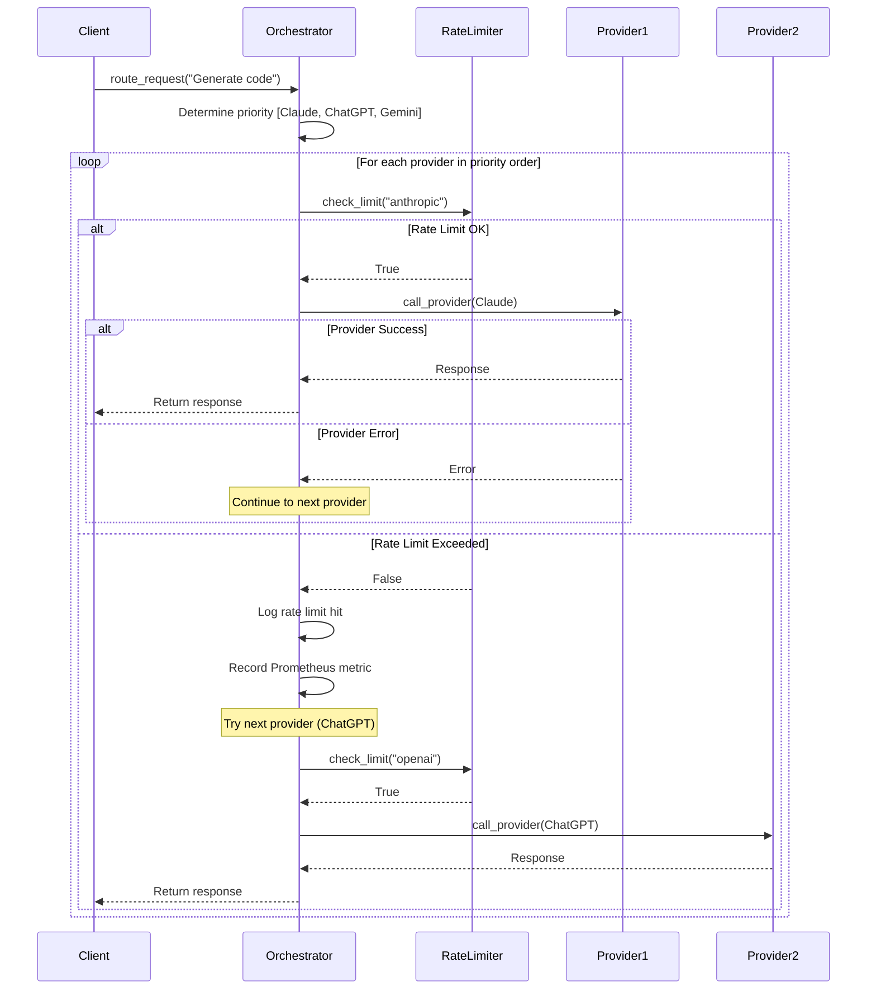

# ADR-002: Token Bucket Rate Limiting with Automatic Fallback

**Status**: Implemented
**Date**: 2025-10-27
**Decision Makers**: System Architecture Team
**Related Documents**: [ADR-001 Monitoring](./ADR-001-MONITORING-DASHBOARD.md), [ARCHITECTURE.md](../ARCHITECTURE.md)

---

## Context and Problem Statement

LLM providers impose strict rate limits and quotas:

**Current Provider Limits**:
- **OpenAI (ChatGPT)**: 3 requests/min, 200 requests/day (Tier 1)
- **Anthropic (Claude)**: 5 requests/min, 1000 requests/day (Free tier)
- **Google (Gemini)**: 15 requests/min, **50 requests/day** (Free tier) ⚠️
- **Local (Ollama)**: No limits (hardware constrained)

**Problems Without Rate Limiting**:

1. **Quota Exhaustion**: Gemini's 50/day limit exhausted in hours, causing 429 errors
2. **Provider Unavailability**: Rate-limited providers fail all requests until cooldown
3. **Poor User Experience**: Users see cryptic "quota exceeded" errors
4. **No Graceful Degradation**: System doesn't fall back to alternate providers
5. **Cost Spikes**: Uncontrolled usage leads to unexpected API bills
6. **Request Bursts**: Traffic spikes (e.g., batch processing) overwhelm providers

**Real-World Impact**:
- Gemini quota exhausted → System health drops from 60% to 40%
- Claude rate limits hit → Requests fail without fallback
- No visibility into approaching limits → Blind to imminent failures

The system needed intelligent rate limiting that:
1. Prevents quota exhaustion before hitting provider limits
2. Enables automatic fallback to alternate providers
3. Provides real-time visibility into rate limit status
4. Handles traffic bursts gracefully (burst capacity)
5. Works seamlessly with existing routing logic

---

## Decision Drivers

1. **Reliability**: Prevent provider quota exhaustion and service degradation
2. **User Experience**: Transparent fallback, no error messages to users
3. **Cost Control**: Stay within free tiers, avoid unexpected charges
4. **Observability**: Real-time visibility into rate limit status
5. **Flexibility**: Support different limits per provider
6. **Performance**: Minimal overhead (<5ms per request)
7. **Fairness**: Prevent single user/request from consuming all quota

---

## Considered Options

### Option 1: Fixed Window Rate Limiting
```python
# Simple counter reset every minute
requests_this_minute[provider] += 1
if requests_this_minute[provider] > limit:
    reject()
```

**Pros**: Simple, easy to understand, low memory
**Cons**:
- Burst problem: 2× limit possible (59s + 1s boundary)
- No smooth rate distribution
- Harsh cutoffs at window boundaries

**Verdict**: ❌ Too simplistic, burst vulnerability

### Option 2: Sliding Window Log
```python
# Store timestamp of each request
request_log[provider].append(now())
# Count requests in last 60 seconds
recent = [r for r in request_log if r > now() - 60]
if len(recent) > limit:
    reject()
```

**Pros**: Accurate rate limiting, no burst vulnerability
**Cons**:
- High memory usage (stores every request timestamp)
- O(n) complexity for checking (n = requests in window)
- Doesn't support burst capacity

**Verdict**: ❌ Too expensive for high-traffic scenarios

### Option 3: **Token Bucket Algorithm** ✅
```python
# Tokens replenish at fixed rate, bucket has capacity
bucket.tokens = min(bucket.capacity, bucket.tokens + time_delta * rate)
if bucket.tokens >= 1:
    bucket.tokens -= 1
    allow()
else:
    reject()
```

**Pros**:
- Smooth rate distribution
- Built-in burst capacity
- O(1) complexity
- Minimal memory (fixed per provider)
- Industry standard (used by AWS, GitHub, Stripe)

**Cons**:
- Slightly more complex than fixed window
- Requires timestamp tracking

**Verdict**: ✅ **SELECTED** - Best balance of accuracy, performance, and features

### Option 4: Leaky Bucket
Similar to token bucket but enforces strict output rate.

**Pros**: Perfectly smooth output
**Cons**: No burst capacity, can delay urgent requests

**Verdict**: ❌ Too rigid, burst capacity needed for traffic spikes

---

## Decision Outcome

**Chosen Option**: Token Bucket Algorithm (Option 3)

Implemented with:
- **Per-Provider Buckets**: Independent limits for each LLM provider
- **Configurable Rates**: Different limits per provider tier
- **Burst Capacity**: Handle traffic spikes gracefully
- **Automatic Fallback**: Route to alternate provider when limited
- **Prometheus Integration**: Metrics for rate limit hits and enforcement

---

## Implementation Details

### Token Bucket Core Algorithm

**File**: `src/core/rate_limiter.py`

```python
class TokenBucket:
    def __init__(self, rate: int, capacity: int):
        """
        rate: Tokens added per minute
        capacity: Maximum burst capacity
        """
        self.rate = rate
        self.capacity = capacity
        self.tokens = capacity  # Start full
        self.last_update = time.time()

    def consume(self, tokens: int = 1) -> bool:
        """Try to consume tokens. Returns True if allowed."""
        now = time.time()
        time_delta = now - self.last_update

        # Replenish tokens based on time elapsed
        new_tokens = time_delta * (self.rate / 60.0)  # rate per second
        self.tokens = min(self.capacity, self.tokens + new_tokens)
        self.last_update = now

        # Try to consume
        if self.tokens >= tokens:
            self.tokens -= tokens
            return True
        return False
```

**Key Design Decisions**:

1. **Replenishment on Access**: Tokens added when `consume()` called, not background thread
   - **Why**: Simpler, no threading complexity, more testable
   - **Trade-off**: Slight inaccuracy if no requests for long period (negligible)

2. **Start Full**: Bucket initialized with `capacity` tokens
   - **Why**: Allow immediate burst when system starts
   - **Alternative**: Start empty (too restrictive on startup)

3. **Floating Point Tokens**: Use `float` for precise replenishment
   - **Why**: Avoid rounding errors with fractional rates (e.g., 0.05 tokens/sec)
   - **Precision**: 64-bit float sufficient for rate limiting

4. **Per-Provider Buckets**: Separate bucket for each LLM
   - **Why**: Prevent one provider's limits affecting others
   - **Memory**: ~100 bytes per bucket × 5 providers = 500 bytes (negligible)

### Rate Limiter Configuration

**Provider Limits** (`src/core/rate_limiter.py:37-41`):

```python
RATE_LIMITS = {
    "openai": {"rate": 3, "capacity": 5},        # 3/min, burst 5
    "anthropic": {"rate": 5, "capacity": 8},     # 5/min, burst 8
    "google": {"rate": 10, "capacity": 15},      # 10/min, burst 15
    "local": {"rate": 100, "capacity": 100},     # No practical limit
}
```

**Configuration Rationale**:

| Provider | API Limit | Our Limit | Burst | Reasoning |
|----------|-----------|-----------|-------|-----------|
| OpenAI | 3/min | 3/min | 5 | Match exactly, allow small burst |
| Anthropic | 5/min | 5/min | 8 | Match exactly, 60% burst capacity |
| Google | 15/min | 10/min | 15 | **Conservative** to preserve daily quota |
| Local | Unlimited | 100/min | 100 | Hardware limit, prevent runaway |

**Why Conservative Google Limit?**
- Daily quota: 50 requests
- At 15/min: Exhausted in ~3.3 minutes
- At 10/min: Lasts ~5 minutes (still fast, but more controlled)
- **Future**: Implement daily quota tracking separately

### Integration with Orchestrator

**File**: `src/core/orchestrator.py:499-521`

```python
# Check rate limit before making request
rate_limiter_provider = self._get_rate_limiter_provider_name(provider)
if not self.rate_limiter.check_limit(rate_limiter_provider):
    self.logger.warning(
        "rate_limit_exceeded_skipping_provider",
        provider=provider.value,
        rate_limiter_provider=rate_limiter_provider
    )

    # Record rate limit metric
    if METRICS_AVAILABLE:
        rate_limit_counter.labels(provider=provider.value).inc()

    # Treat as error and try next provider (automatic fallback)
    last_error = Exception(f"Rate limit exceeded for {provider.value}")
    continue  # Skip to next provider in fallback chain
```

**Provider Name Mapping** (`orchestrator.py:97-114`):

```python
def _get_rate_limiter_provider_name(self, provider: LLMProvider) -> str:
    """Map LLMProvider enum to rate limiter provider name."""
    mapping = {
        LLMProvider.CHATGPT: "openai",
        LLMProvider.CLAUDE: "anthropic",
        LLMProvider.CLAUDE_CODE: "anthropic",  # Same API
        LLMProvider.GEMINI: "google",
        LLMProvider.LOCAL: "local",
    }
    return mapping.get(provider, provider.value)
```

**Why Separate Mapping?**
- `LLMProvider` enum: User-facing names (CHATGPT, CLAUDE_CODE)
- Rate limiter: API provider names (openai, anthropic)
- Claude and Claude Code share same API → Same rate limit bucket
- Decoupling allows flexibility (e.g., multiple OpenAI models)

### Automatic Fallback Flow



**Fallback Behavior**:
1. Rate limit check treats limit as "provider unavailable"
2. Orchestrator continues to next provider in priority list
3. User never sees rate limit error (transparent fallback)
4. Metrics recorded for observability
5. If all providers limited → Return error (rare edge case)

---

## Token Bucket Mathematics

### Replenishment Calculation

**Given**:
- Rate: R tokens/minute
- Time delta: Δt seconds

**Tokens added**:
```
new_tokens = Δt × (R / 60)
```

**Example** (OpenAI, R=3):
- 20 seconds elapsed: 20 × (3/60) = 1 token
- 40 seconds elapsed: 40 × (3/60) = 2 tokens
- 60 seconds elapsed: 60 × (3/60) = 3 tokens

### Burst Capacity Analysis

**Scenario**: Traffic spike of 8 requests in 10 seconds

**Without Burst (Capacity = Rate)**:
```
Bucket: 3 tokens
Request 1: ✅ (2 remaining)
Request 2: ✅ (1 remaining)
Request 3: ✅ (0 remaining)
Requests 4-8: ❌ Rate limited
```
**Result**: 5 requests rejected, poor UX

**With Burst (Capacity = 5)**:
```
Bucket: 5 tokens
Request 1: ✅ (4 remaining)
Request 2: ✅ (3 remaining)
Request 3: ✅ (2 remaining)
Request 4: ✅ (1 remaining)
Request 5: ✅ (0 remaining)
Requests 6-8: ❌ Rate limited
```
**Result**: Only 3 requests rejected, better UX

### Long-Term Rate Enforcement

**Question**: Does burst capacity allow exceeding rate limit long-term?
**Answer**: No, burst is temporary.

**Proof** (60-second window):
```
Max tokens consumed: capacity (initial) + rate (replenished)
For OpenAI: 5 (burst) + 3 (replenished) = 8 requests/min

BUT:
- Burst is one-time (bucket drains to 0)
- Next 60 seconds: Only 3 tokens replenish
- Average over time: 3 requests/min (enforced)
```

**Conclusion**: Burst allows short spikes, but long-term average matches rate.

---

## Monitoring and Observability

### Prometheus Metrics

**Counter**: `rate_limit_exceeded_total{provider="openai"}`
- Incremented each time provider rate limited
- Labels: provider name
- Use case: Alert when limits frequently hit

**Gauge**: `rate_limit_tokens_available{provider="openai"}`
- Current tokens in bucket
- Labels: provider name
- Use case: Dashboard visualization, capacity planning

**Example PromQL Queries**:
```promql
# Rate of rate limit hits (per minute)
rate(rate_limit_exceeded_total[1m])

# Providers with low token availability
rate_limit_tokens_available < 2

# Percentage of requests rate limited
rate(rate_limit_exceeded_total[5m]) / rate(llm_requests_total[5m]) * 100
```

### Dashboard Visualization

**Monitoring Dashboard** (`frontend/src/pages/MonitoringDashboardPage.tsx:287-304`):

```tsx
{provider.rate_limit_stats.rate_per_minute !== undefined && (
  <div className="mt-3 pt-3 border-t border-gray-100">
    <div className="flex items-center justify-between">
      <p className="text-xs text-gray-600">Rate Limit</p>
      <p className="text-xs font-semibold">
        {provider.rate_limit_stats.available_tokens?.toFixed(0) || 0} /
        {provider.rate_limit_stats.rate_per_minute} tokens
      </p>
    </div>
    <div className="mt-1 w-full bg-gray-200 rounded-full h-2">
      <div
        className="bg-primary-600 h-2 rounded-full transition-all"
        style={{
          width: `${(available / capacity) * 100}%`
        }}
      />
    </div>
  </div>
)}
```

**Visual Indicators**:
- Progress bar: Token availability (0-100%)
- Numeric display: "3.2 / 5 tokens"
- Updates every 5 seconds (auto-refresh)

---

## Performance Characteristics

### Latency Analysis

**Token Bucket Operations**:
1. `time.time()`: ~0.1μs (system call)
2. Token calculation: ~0.01μs (float arithmetic)
3. Comparison: ~0.01μs (if statement)
4. **Total**: <0.5μs per request

**Rate Limit Check in Request Path**:
```
Total request time: ~500ms (LLM API call)
Rate limit overhead: <0.5μs
Percentage impact: 0.0001%
```

**Conclusion**: Rate limiting overhead is negligible.

### Memory Usage

**Per-Bucket Memory**:
```python
class TokenBucket:
    rate: float          # 8 bytes
    capacity: float      # 8 bytes
    tokens: float        # 8 bytes
    last_update: float   # 8 bytes
    # Total: 32 bytes
```

**Total Memory** (5 providers):
```
5 providers × 32 bytes = 160 bytes
```

**Conclusion**: Memory usage is trivial.

### Concurrency Safety

**Thread Safety**: ⚠️ Not thread-safe (current implementation)

**Current Deployment**: Single-process FastAPI (no issue)

**Future Multi-Process Deployment**:
**Problem**: Shared rate limit state needed across workers

**Solutions**:
1. **Redis-Backed Buckets** (Recommended):
   ```python
   tokens = redis.get(f"bucket:{provider}:tokens")
   # Atomic increment with Lua script
   ```

2. **Sticky Sessions**: Route same provider to same worker
   - Simple, but uneven load distribution

3. **Distributed Lock**: Use Redis lock for bucket updates
   - More complex, potential bottleneck

**Recommended**: Implement Redis-backed buckets when scaling to multi-process.

---

## Security Considerations

### Denial of Service (DoS) Protection

**Attack Scenario**: Malicious user sends flood of requests to exhaust quota.

**Current Protection**:
- Rate limiter prevents exceeding provider limits
- Automatic fallback to other providers
- Local LLM as final fallback (no external quota)

**Gaps**:
- No per-user rate limiting (single global pool)
- No request authentication/authorization

**Future Mitigation**:
```python
# Per-user rate limiting
user_bucket = rate_limiter.get_user_bucket(user_id)
if not user_bucket.consume():
    raise HTTPException(status_code=429, detail="User rate limited")
```

### Cost Control

**Current State**:
- Rate limiting prevents runaway costs
- Conservative limits for paid providers
- Monitoring tracks token usage

**Future Enhancements**:
1. **Daily Quota Tracking**: Separate from per-minute rate limits
   ```python
   daily_quota["google"] = 50  # Gemini free tier
   if daily_requests["google"] >= daily_quota["google"]:
       disable_provider("google")
   ```

2. **Cost Budgets**: Set monthly spending limits
   ```python
   if monthly_cost["openai"] > budget["openai"]:
       alert_admin()
       disable_provider("openai")
   ```

3. **Tiered Limits**: Different limits for free vs. paid tiers

---

## Consequences

### Positive

1. **Quota Preservation**: Prevents exhausting Gemini's 50/day limit in minutes
2. **Graceful Degradation**: Automatic fallback maintains service availability
3. **Improved Reliability**: System health more stable (fewer provider failures)
4. **Cost Predictability**: Controlled usage prevents surprise bills
5. **User Transparency**: Rate limiting invisible to users (handled by fallback)
6. **Observability**: Real-time visibility into rate limit status
7. **Burst Handling**: Traffic spikes don't immediately fail

### Negative

1. **Complexity**: Additional component to maintain and test
2. **State Management**: Requires tracking bucket state (memory/Redis)
3. **Configuration Burden**: Must tune limits per provider and tier
4. **Debugging Difficulty**: Rate limit interactions with fallback can be complex
5. **False Limitations**: Conservative limits may underutilize provider capacity

### Risks and Mitigations

| Risk | Impact | Probability | Mitigation |
|------|--------|-------------|------------|
| Bucket state desync in multi-process | High | Medium | Implement Redis-backed buckets |
| Over-conservative limits waste quota | Low | High | Monitor token utilization, tune limits |
| Rate limit obscures provider errors | Medium | Low | Log all rate limit hits, metrics |
| Clock skew causes incorrect replenishment | Medium | Very Low | Use monotonic clock (`time.monotonic()`) |

---

## Testing Strategy

### Unit Tests (To Be Implemented)

**Token Bucket Correctness**:
```python
def test_token_bucket_basic():
    bucket = TokenBucket(rate=60, capacity=60)  # 1 token/sec
    assert bucket.consume() == True  # First request
    assert bucket.consume() == True  # Second request
    # ... consume all 60 tokens
    assert bucket.consume() == False  # Bucket empty

def test_token_bucket_replenishment():
    bucket = TokenBucket(rate=60, capacity=60)
    bucket.tokens = 0  # Drain bucket
    time.sleep(1)  # Wait 1 second
    assert bucket.consume() == True  # 1 token replenished

def test_burst_capacity():
    bucket = TokenBucket(rate=3, capacity=5)
    # Consume burst
    assert bucket.consume() == True  # 1
    assert bucket.consume() == True  # 2
    assert bucket.consume() == True  # 3
    assert bucket.consume() == True  # 4
    assert bucket.consume() == True  # 5
    assert bucket.consume() == False  # Burst exhausted
```

### Integration Tests

**Orchestrator Fallback**:
```python
def test_rate_limit_triggers_fallback():
    # Exhaust Claude's rate limit
    for _ in range(10):
        orchestrator.route_request("test", preferred_provider=LLMProvider.CLAUDE)

    # Next request should fallback to ChatGPT
    response = orchestrator.route_request("test", preferred_provider=LLMProvider.CLAUDE)
    assert response.provider == LLMProvider.CHATGPT
```

**Metrics Recording**:
```python
def test_rate_limit_metrics():
    initial_count = rate_limit_counter._value.get()

    # Trigger rate limit
    exhaust_rate_limit("openai")
    orchestrator.route_request("test", preferred_provider=LLMProvider.CHATGPT)

    # Verify metric incremented
    assert rate_limit_counter._value.get() > initial_count
```

### Load Testing

**Burst Traffic Simulation**:
```bash
# Send 100 requests in 10 seconds
ab -n 100 -c 10 http://localhost:8000/api/chat
```

**Expected Behavior**:
- First 5-8 requests: Instant (burst capacity)
- Remaining requests: Throttled to 3/min (OpenAI rate)
- No provider errors (fallback handles limits)

---

## Lessons Learned

### Implementation Challenges

1. **Provider Name Mapping Complexity**
   - **Problem**: LLMProvider enum doesn't match API provider names
   - **Solution**: Created explicit mapping function
   - **Lesson**: Don't assume enum names match external API names

2. **Variable Naming Consistency**
   - **Problem**: `CONTEXT_METRICS_AVAILABLE` didn't include rate limit metrics
   - **Solution**: Renamed to `METRICS_AVAILABLE`
   - **Lesson**: Variable names should reflect full scope

3. **Fallback Chain Integration**
   - **Problem**: Rate limit check needed to integrate with existing fallback logic
   - **Solution**: Treat rate limit as provider error (continue loop)
   - **Lesson**: Leverage existing patterns rather than reimplementing

### Best Practices Established

1. **Conservative Limits**: Set limits 20-30% below provider limits for safety margin
2. **Burst Capacity**: 50-100% burst allowance for traffic spikes
3. **Prometheus Integration**: All rate limit events recorded for analysis
4. **Logging**: Log every rate limit hit with provider name and context
5. **Graceful Fallback**: Never expose rate limit errors to end users

---

## Future Enhancements

### Phase 2: Advanced Rate Limiting (Next 3 Months)

1. **Daily Quota Tracking**
   ```python
   daily_quota = {
       "google": 50,      # Gemini free tier
       "openai": 200,     # GPT-3.5 Tier 1
       "anthropic": 1000  # Claude free tier
   }
   ```

2. **Redis-Backed Buckets** (Multi-Process)
   ```python
   class RedisTokenBucket:
       def consume(self, provider: str) -> bool:
           # Atomic Lua script for token consumption
           script = """
           local tokens = redis.call('GET', KEYS[1])
           if tonumber(tokens) >= 1 then
               redis.call('DECRBY', KEYS[1], 1)
               return 1
           else
               return 0
           end
           """
           return redis.eval(script, [f"bucket:{provider}"])
   ```

3. **Per-User Rate Limiting**
   ```python
   user_limits = {
       "free_tier": {"rate": 10, "capacity": 15},
       "pro_tier": {"rate": 100, "capacity": 150},
   }
   ```

### Phase 3: Cost Optimization (6-12 Months)

1. **Adaptive Rate Limiting**
   - Increase limits during off-peak hours
   - Decrease limits when approaching budget thresholds
   - ML-based prediction of quota needs

2. **Priority Queuing**
   - High-priority requests bypass rate limits (limited pool)
   - Low-priority requests deferred/batched

3. **Smart Provider Selection**
   - Factor in cost per token, not just availability
   - Prefer cheaper providers when quality acceptable

---

## References

- [Token Bucket Algorithm](https://en.wikipedia.org/wiki/Token_bucket)
- [Google Cloud Rate Limiting](https://cloud.google.com/architecture/rate-limiting-strategies-techniques)
- [Stripe Rate Limiting](https://stripe.com/docs/rate-limits)
- [OpenAI Rate Limits](https://platform.openai.com/docs/guides/rate-limits)
- [Anthropic Rate Limits](https://docs.anthropic.com/en/api/rate-limits)

---

## Appendix: Provider Limit Details

### OpenAI (ChatGPT)

**Free Tier (Tier 1)**:
- Requests: 3/min, 200/day
- Tokens: 40K TPM, 150K TPD
- Models: GPT-3.5-turbo

**Paid Tier 2**:
- Requests: 500/min
- Tokens: 100K TPM

### Anthropic (Claude)

**Free Tier**:
- Requests: 5/min, 1000/day
- Tokens: 25K TPM, 300K TPD
- Models: Claude 3 Haiku

**Paid Pro**:
- Requests: 50/min
- Tokens: 100K TPM

### Google (Gemini)

**Free Tier**: ⚠️ Most Restrictive
- Requests: 15/min, **50/day**
- Tokens: N/A (requests only)
- Models: Gemini 1.5 Flash

**Paid Tier**:
- Requests: 1000/min, 10M/day

### Local (Ollama)

**Limits**: Hardware-dependent
- CPU: ~1 request/sec (poor performance)
- GPU: ~10 requests/sec (acceptable)
- No quota restrictions

---

**Document Version**: 1.0
**Last Updated**: 2025-10-27
**Next Review**: 2025-11-27
